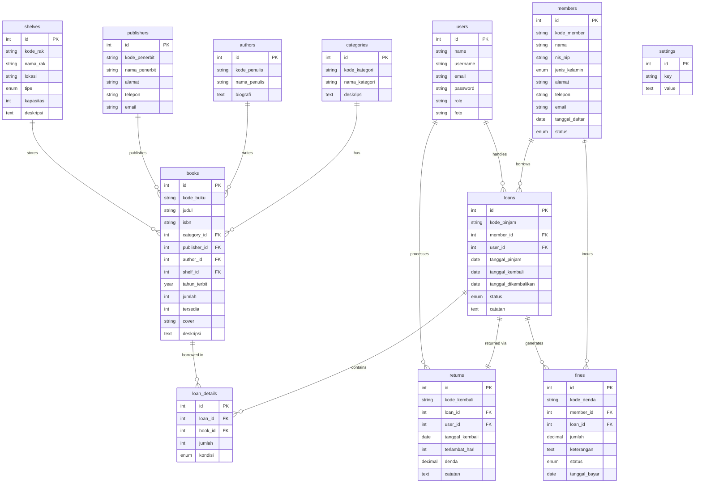

```mermaid
    erDiagram
        %% Master Data
        users {
            int id PK
            string name
            string username
            string email
            string password
            string role
            string foto
        }
        categories {
            int id PK
            string kode_kategori
            string nama_kategori
            text deskripsi
        }
        authors {
            int id PK
            string kode_penulis
            string nama_penulis
            text biografi
        }
        publishers {
            int id PK
            string kode_penerbit
            string nama_penerbit
            string alamat
            string telepon
            string email
        }
        shelves {
            int id PK
            string kode_rak
            string nama_rak
            string lokasi
            enum tipe
            int kapasitas
            text deskripsi
        }
        members {
            int id PK
            string kode_member
            string nama
            string nis_nip
            enum jenis_kelamin
            string alamat
            string telepon
            string email
            date tanggal_daftar
            enum status
        }
        settings {
            int id PK
            string key
            text value
        }

        %% Transaksi Data
        books {
            int id PK
            string kode_buku
            string judul
            string isbn
            int category_id FK
            int publisher_id FK
            int author_id FK
            int shelf_id FK
            year tahun_terbit
            int jumlah
            int tersedia
            string cover
            text deskripsi
        }
        loans {
            int id PK
            string kode_pinjam
            int member_id FK
            int user_id FK
            date tanggal_pinjam
            date tanggal_kembali
            date tanggal_dikembalikan
            enum status
            text catatan
        }
        loan_details {
            int id PK
            int loan_id FK
            int book_id FK
            int jumlah
            enum kondisi
        }
        returns {
            int id PK
            string kode_kembali
            int loan_id FK
            int user_id FK
            date tanggal_kembali
            int terlambat_hari
            decimal denda
            text catatan
        }
        fines {
            int id PK
            string kode_denda
            int member_id FK
            int loan_id FK
            decimal jumlah
            text keterangan
            enum status
            date tanggal_bayar
        }

        %% Relasi / Foreign Keys
        categories ||--o{ books : "has"
        authors ||--o{ books : "writes"
        publishers ||--o{ books : "publishes"
        shelves ||--o{ books : "stores"
        
        members ||--o{ loans : "borrows"
        users ||--o{ loans : "handles"
        
        loans ||--o{ loan_details : "contains"
        books ||--o{ loan_details : "borrowed in"
        
        loans ||--|| returns : "returned via"
        users ||--o{ returns : "processes"
        
        members ||--o{ fines : "incurs"
        loans ||--o{ fines : "generates"
```